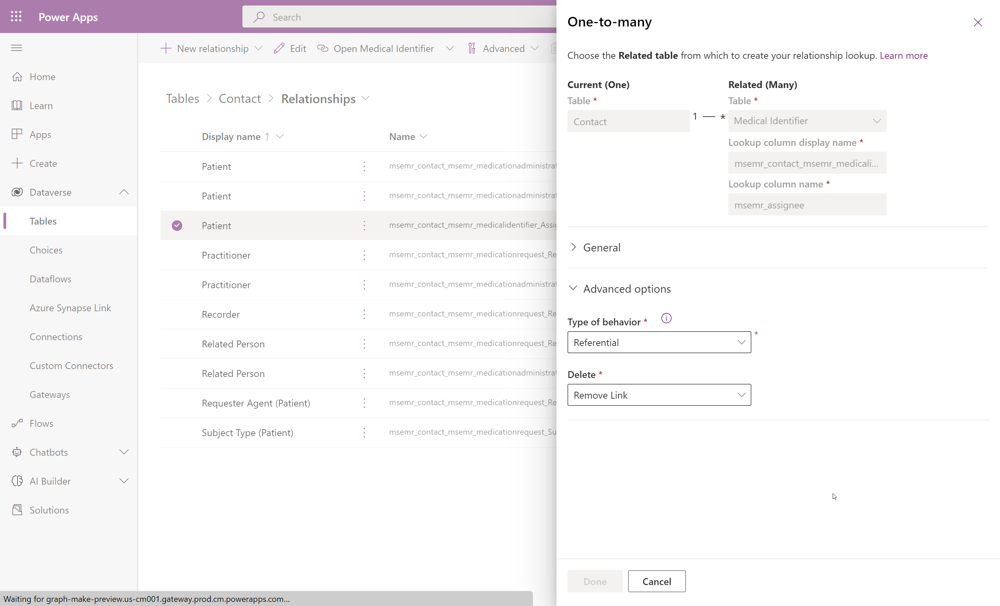

# Deleting Records in Dataverse

Removing test data from Dataverse is required after a test cycle (In the same way it is  in FHIR). This section will provide examples of the calls available for performing a Dataverse data cleanup.

## Data Clean Up Considerations

Some considerations when designing a cleanup plan:

- What records will require delete?
  - Even if it's a single table (i.e. Contact), be aware of existing relationships with other tables.  
  - Be aware of cascade rules defined on the table relationship configuration, and any effects that may have on related records if they exist.  
[About table relationships for Microsoft Dataverse - Power Apps &#124; Microsoft Docs](https://docs.microsoft.com/en-us/power-apps/maker/data-platform/create-edit-entity-relationships#behaviors)  

  In the example below, deleting the parent table record (Contact) will result in orphaned child records (Medical Identifier) due to the type of behavior being set to _Referential_.  

  If you want to also delete the child records, set the Type of Behavior to _Parental_ instead.

    

- Is there any custom logic enabled on Contact that may be triggered by a Delete or may prevent a Delete?

>Consider turning off the sync agent before attempting a bulk delete operation in FHIR. When using any delete operation (Both hard and soft delete) in FHIR, a **DELETE message** will be sent to Dataverse.
>
>When a DELETE operation is performed in FHIR, the Sync Agent (version 1.3 or earlier) will not delete records in Dataverse, but will log a 404-Not Found error in application logs.  

Some common methods to consider for performing data cleanup tasks directly in Dataverse are listed below. The options in **bold** may be best suited for  clean up jobs that involve deleting records in FHIR, as you will already be using API calls.  

## DELETE Calls

| **Type** | **Description** | **Reference** |
| --- | --- | --- |
| Manual | User searches for patient by FHIR ID using Advanced Find, deletes record(s) using Delete button. | [Advanced find - Power Apps &#124; Microsoft Docs](https://docs.microsoft.com/en-us/power-apps/user/advanced-find) |  
| Manual | User bulk deletes records via App User Interface | [Delete bulk records - Power Platform &#124; Microsoft Docs](https://docs.microsoft.com/en-us/power-platform/admin/delete-bulk-records) |  
| Low-code Automation | Configure a Cloud Flow to delete based on file of IDs | [Use a flow to delete a row from Dataverse - Power Automate &#124; Microsoft Docs](https://docs.microsoft.com/en-us/power-automate/dataverse/delete-row) |  
| **Script/code** | **Delete operation via Dataverse Web API** | [Update and delete table rows using the Web API (Microsoft Dataverse) - Power Apps &#124; Microsoft Docs](https://docs.microsoft.com/en-us/power-apps/developer/data-platform/webapi/update-delete-entities-using-web-api#basic-delete) |  
| **Script/code** | **Initiate a bulk delete job via Web API using the BulkDeleteRequest message** | [Delete data in bulk (Microsoft Dataverse) - Power Apps &#124; Microsoft Docs](https://docs.microsoft.com/en-us/power-apps/developer/data-platform/delete-data-bulk) |  
