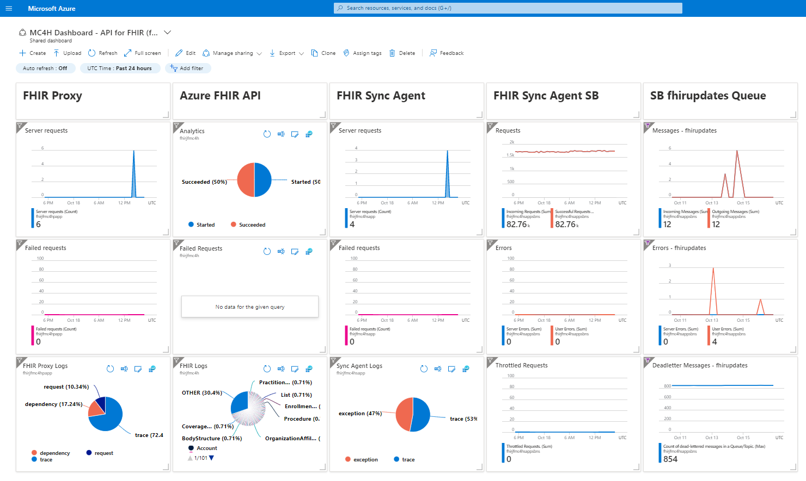

# Monitoring Azure FHIR Architectures with Dashboards

Azure Dashboards can be useful for monitoring the health and throughput of Azure resources. Included here are some dashboard templates for common reference architectures for Azure Health Data Services, with instructions to deploy them into Azure with your subscription, resource group, and resource context. 

# Available Dashboard Templates

Available templates for common reference architectures:

## Azure API for FHIR + OSS (Coming soon...)

Includes monitoring for:
* Azure API for FHIR
* FHIR Proxy (OSS)
* FHIR Loader (OSS)

## Azure API for FHIR + Proxy + Sync Agent
[JSON file available here](./Samples/MC4H%20Dashboard%20-%20APIforFHIR_Proxy_SyncAgent.json)

Includes monitoring for:
* Azure API for FHIR
* FHIR Proxy (OSS)
* FHIR Sync Agent
* FHIR Sync Agent Service Bus
* fhirupdates Service Bus Queue (updates TO Dataverse)

The JSON for this template has been modified to include placeholders for your details specific to your Azure deployment. The table below outlines all placeholders in this template which should be replaced prior to upload into your Azure portal. 
| Replace Text  | Replace With   | 
|-------------- | -------------- |
| `[SUBSCRIPTION_ID]`  | Azure subscription ID     | 
| `[RESOURCEGROUP_NAME]`   | The name of the Resource Group of the FHIR architecture monitored by this dashbaord  | 
| `[FHIRPROXY_APPINSIGHTS_NAME]`   | Application Insights resource name, containing logs for the FHIR Proxy Function App   | 
| `[FHIRSYNCAGENT_APPINSIGHTS_NAME]`   | Application Insights resource name, containing logs for the FHIR Sync Agent Function App  | 
| `[SERVICEBUSNAMESPACE_NAME]`  | Service Bus Namespace resource name used by the FHIR Proxy and Sync Agent   | 
| `[AZUREAPIFORFHIR_NAME]`  | Azure API for FHIR resource name    | 

# Instructions for Deployment

The templates are Azure dashboard definition .json files exported from Azure, which have had environment specific details replaced with placeholders. To use them in your own Azure environment, follow the instructions below:

1. Download and open the .json file in your favorite .json editor (use links above or see the [samples](./Samples/) folder)
2. Replace all references to the placeholders listed in template details above with the apppropriate values from your Azure environment (be sure to relace the brackets `[]` as well)
3. Save the updated .json file
4. In Azure, go to _Dashboard_ from the Portal Menu and use the Upload feature to create a new dashboard by uploading the .json file just edited
5. Publish and Share the dashboard as desired

=

References:
* https://learn.microsoft.com/en-us/azure/azure-portal/azure-portal-dashboards
* https://learn.microsoft.com/en-us/azure/azure-portal/azure-portal-dashboards-create-programmatically#json-representation-of-our-example-dashboard