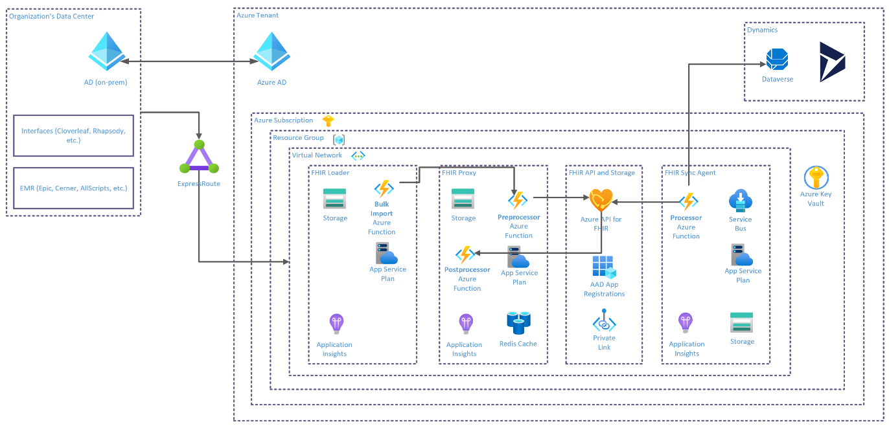

# Azure FHIR Data Architectures
> After reviewing this material, get hands on experience with: 
[Lab F1: Deploy FHIR Components with ARM Templates](./Lab_F1) 
Continue to next module: [Dynamics 365 FHIR Integration](https://github.com/microsoft/MC4H-Acceleration/tree/main/PatientOutreach_UserStoryTraining/3_D365_FHIR_Integration)

 FHIR® (Fast Healthcare Interoperability Resources) is an industry standard for health data storage and exchange. Microsoft is strategically adopting FHIR as the standard format for health data storage and exchange in the Microsoft health data platform. 

 There are currently two managed Azure Services available to support a FHIR infrastructure in Azure. In this training, we will be utilizing the Azure API for FHIR, as it is the generally available (GA) service available to customers currently. 
 * [Azure API for FHIR](https://docs.microsoft.com/en-us/azure/healthcare-apis/azure-api-for-fhir/overview)
 * [Azure Healthcare APIs (preview)](https://azure.microsoft.com/en-us/services/healthcare-apis/)
 
 There are also a number Open Source Software (OSS) projects developed by the Microsoft Health Cloud & Data Architectural Engineering team, including:
 * [FHIR Proxy](https://github.com/microsoft/fhir-proxy)
 * [FHIR Bulk Loader & Export](https://github.com/microsoft/fhir-loader)

 These OSS components deployed along with the Azure API for FHIR provide a FHIR data architecture that can support health data storage and exchange in Azure.

 > NOTE: The new Healthcare APIs (in preview) is the evolved version of Azure API for FHIR and offers additional technology and services, including some capabilities available in the OSS projects above. 

Click the links above to review the capabilities of the Azure API for FHIR, FHIR Proxy, and FHIR Bulk Loader, and how they work together. 

> Complete the lab:
> * [Lab F1: Deploy FHIR Components with ARM Templates](./Lab_F1) 
>
> Continue to next module: [Dynamics 365 FHIR Integration](https://github.com/microsoft/MC4H-Acceleration/tree/main/PatientOutreach_UserStoryTraining/3_D365_FHIR_Integration)

