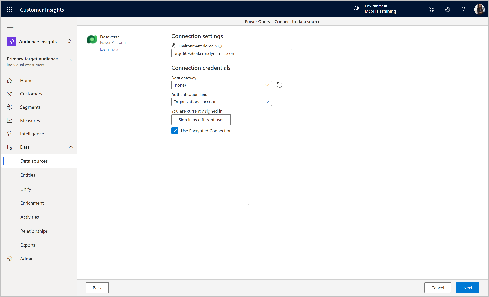

# Ingest D365 Data into Customer Insights
>**Objective:** 
> Configure the Dataverse connector to ingest Patient record with Dataverse identifier to unify with patient data from FHIR Server (for contextual insight visibility in Patient Outreach App)  

## Outcome
* Successful ingestion of Contact (Patient) data into Customer Insights from a Dynamics 365 Marketing environment
> **Estimated Time Commitment:** 
> About 30min active time, about 20 minutes unattended processing time

## Pre-requisites
* Customer Insights tenant subscription
* Customer Insights environment created [Start with Customer Insights](https://docs.microsoft.com/en-us/dynamics365/customer-insights/paid-license)
    * Ensure B2C Environment configuration
* Admin or Contributor permissions to the Customer Insights environment
* Access and permissions to the D365 environment

## Step 1: Connect with the Dataverse Power Query Connector

1.	If not already there, go to the Customer Insights application and select the correct environment in the upper right corner if necessary. 
> https://home.ci.ai.dynamics.com/

2. Ensure Audience Insights area is selected, top left (default).

3. Expand into **Data sources**, click **Add data source** complete the wizard to ingest Patients from Dataverse:
    * Leave **Microsoft Power Query** selected, name the data source such as **D365Patients**, click **Next**.
    * Select **Dataverse** connector (hint: use the search bar), click **Next**.
    * Enter the Dynamics 365 Marketing org **Environment domain** in below format 
    `[orgname].crm.dynamics.com` 
        > NOTE: if in a region other than North America the .crm domain may be different
    * Authenticate with **Organizational account**, see pre-requisites for account requirements. Click **Next** once authenticated.
    * In list of available tables (may take time to load), check **Contact**, and click **Transform data**.

## Step 2: Filter the Contact Data with Power Query

1. Use **Choose Columns** to remove all columns except **contactid, firstname, lastname, emailaddress1, msemr_contacttype,** and **msemr_azurefhirid**. 
    > HINT: use the search bar to find and check each column

2.	Ingest Patients only (ignoring Providers or other types of contacts), by filtering on **Contact Type**: 
    * Select the **msemr_contacttype** column
    * Click **Filter rows** in the ribbon (or **Reduce rows > Filter rows**)
    * Set the filter to **equals 935000000** and click **OK**
    > NOTE: we confirmed this value of the option set value with display “Patient” as a part of the delivered Cloud for Healthcare solutions. Option set values can be validated in the maker portal by viewing the attribute configuration.

3.	Right-click on the **contact** table in the **Queries** pane, and rename to **dataversePatients**. 
> NOTE: If you also want to ingest other contact types from Dynamics 365 to Unify with Patient records (such as prospects), create separate data sources for each type and rename the query for ease of use. 

4. Click **Next**, leave as **Manual Update**,  and **Save**. 
5. Let validation complete, and the new datasource will be listed with status **Refreshing**.

### Customer Card Workaround: Filter the Contact Data with Power Query

This use case utilizes the Customer Insights Contact Card to visualize Unified Profile information in Dynamics 365 forms. Due to a known issue in the Power Query connector, the unique identifier may be returned in all capital letters, which will cause issues with the Contact Card integration. If you have this issue, do the following:
1. Select the **contactid** column
2. In the **Transform** ribbon, select **Text column > Format > lowercase**.

## Step 3: Validate Ingested Tables

1.	Once the initial refresh job completes (about 20 minutes), the data source will show **Successful** in the **Data Sources** area. 
2. Navigate into **Entities** to find a new **dataversePatient** table listed under the **User** group. 
3.	Click into each table to review the Attributes being ingested, and to validate that the data is coming in as expected. 

> You completed the lab! 
Continue to the next lab: [Map, Match & Merge Patient Data](https://github.com/microsoft/MC4H-Acceleration/tree/main/PatientOutreach_UserStoryTraining/4_Customer_Insights_Config/Lab_CI3)
