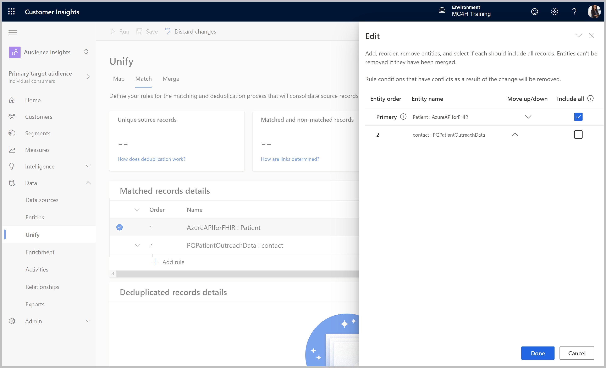
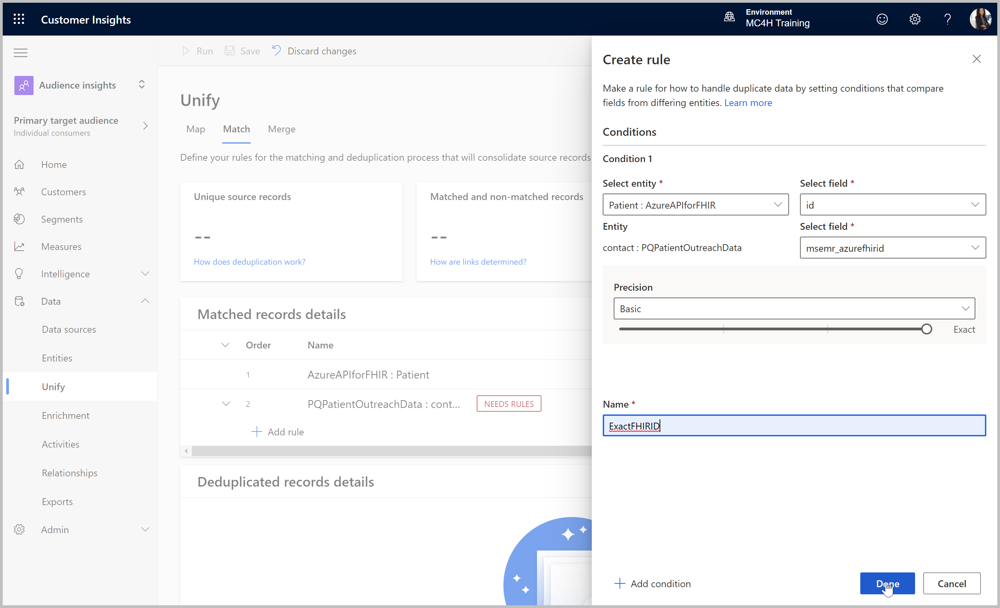
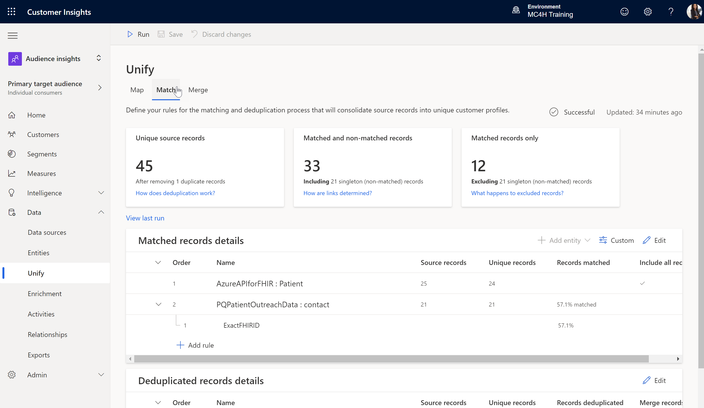
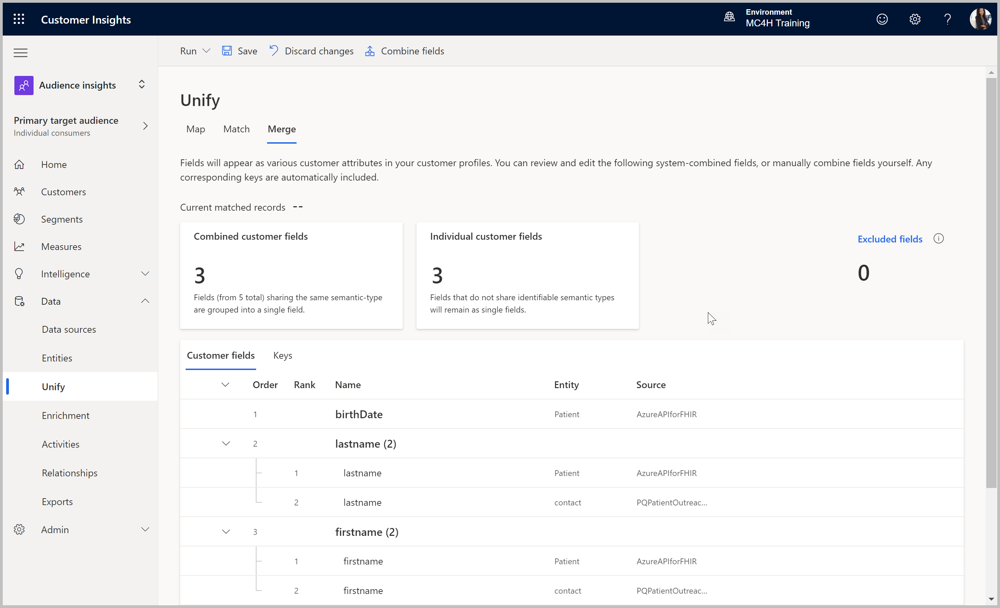

# Map, Match & Merge Patient Data
>**Objective:** 
Configure the mappings between patient records ingested from the FHIR Server and Dataverse and merge into unified profiles, using FHIR ID as the common unique identifier 

## Outcomes
* FHIR and Dynamics 365 patient data merged into unified profiles
* Unified profile cards populated with merged data 
> **Estimated Time Commitment:** 
> About 15min active time, about 10min unattended processing time

## Pre-requisites
* Customer Insights tenant subscription
* Admin or Contributor permissions to the Customer Insights environment
* Customer Insights labs [CI1](https://github.com/microsoft/MC4H-Acceleration/tree/main/PatientOutreach_UserStoryTraining/4_Customer_Insights_Config/Lab_CI1) and [CI2](https://github.com/microsoft/MC4H-Acceleration/tree/main/PatientOutreach_UserStoryTraining/4_Customer_Insights_Config/Lab_CI2) completed

## Step 1: Map

1.	If not already there, go to the Customer Insights application and select the correct environment in the upper right corner if necessary. 
> https://home.ci.ai.dynamics.com/

2. Ensure Audience Insights area is selected, top left (default).

3.	Click **Select Entities** and check the **Patient** and **contact** tables. Expand the contact table and **uncheck** the **msemr_contacttype** field from the contact table, as we don’t need it.  Click **Apply**.

4.	Click into each entity, and review the default mapping to common data model attribute types, updating as necessary to have the following mapping:

| Entities | Primary Key | Mapped Fields | Type (CDM) |
| --- | --- | --- | --- |
| Patient (API for FHIR) | id | birthDate | Person.BirthDate |
| | | email | Identity.Service.Email |
| | | firstname | Person.FirstName |
| | | id | ID |
| | | lastname | Person.LastName |
| | | meta.lastUpdated | Calendar.Date |
| Contact (D365/Dataverse) | contactid | contactid | ID |
| | | emailaddress1 | Identity.Service.Email |
| | | firstname | Person.FirstName |
| | | lastname | Person.LastName |
| | | msemr_azurefhirid	| ID |

5.	Click **Save** at the top of the page.

## Step 2: Match
1.	Move to the **Match** tab of the **Unify** data area. Note that both data sources are already added to the list. 
2.	Click **Add Entity** to add **Patient** and **dataversePatient** entities.
3. Click the **Edit** button and change the order if necessary to make **Patient** entity (FHIR data source) primary, and **include all records** from only this entity
    * We chose **Patient** from FHIR as the primary data source as it is our source of truth, and all subsequent people entities should be matched against this source of truth.
    * For this exercise there may be sample patient data installed in D365 which will not have matches in FHIR. Not including all for the dataversePatient entity will ignore any records without a match in FHIR.

> NOTE: In a production Cloud for Healthcare deployment including Azure API for FHIR and Dynamics 365 or Power Apps on Dataverse, it is important that all patient records originate in the EHR, flowing through the Azure FHIR architecture into Dataverse. This means there should not be patient records in Dataverse that don't exist in Azure API for FHIR. In this case, including all from both FHIR and Dataverse may help in identifying patient data created outside of this supported flow. 

4.	Click the **Add rule** and add a single exact match condition on the FHIR ID attribute in each entity:
    * **Select entity** | **Select field**: 
        * Patient:AzureAPIforFHIRid | id
        * dataversePatient:D365Patients | msemr_azurefhirid
    * Set **Precision** to **Basic** and **Exact**
    * Give the rule a **Name** such as **ExactFHIRID**
    * Click **Done** once complete

5.	Click **Save**, and **Run** to begin matching (may take a few minutes). Once Complete, the insights will contain data and the status will show successful above the insights.

## Step 3: Merge

1.	Once the Match process is complete and you have at least one matching pair, move to the **Merge** tab of **Unify**.

2. Adjust the **Rank**, or click the **Exclude** icon for each field with user experience in mind. 
    > The field definitions here will define what is included in the Unified Profile. If attributes are duplicate and the values will either be identical or should not be used in favor of a more reliable source use Exclude to keep the single reliable source. Otherwise Rank can provide use of multiple sources where they may be different.
3. Select the **Keys** tab and check that the correct keys for each system are identified. The **CustomerID** with source **System** will also be listed - this is the Unified Profile identifier generated by Customer Insights.

4. Finally, **Save** the changes and **Run only Merge**.

## Step 4: Validate the Unified Profiles

1. When the merge process is complete (about 10 minutes), a **Successful** status will show at the top right of the Merge page.
2. Navigate into **Entities** to find the **Customer** table listed under the **Profile** group. 
3.	Click into the entity to review the merged attributes and data. 

> You completed the lab! 
Continue to the next lab: [Define Relationships & Activities](https://github.com/microsoft/MC4H-Acceleration/tree/main/PatientOutreach_UserStoryTraining/4_Customer_Insights_Config/Lab_CI4)