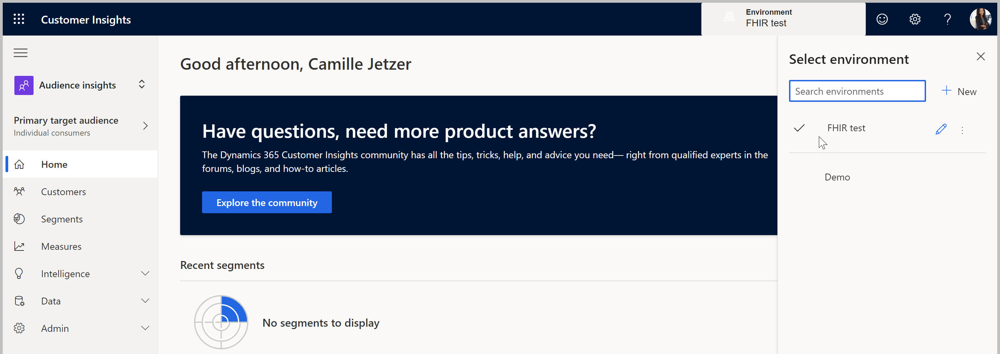
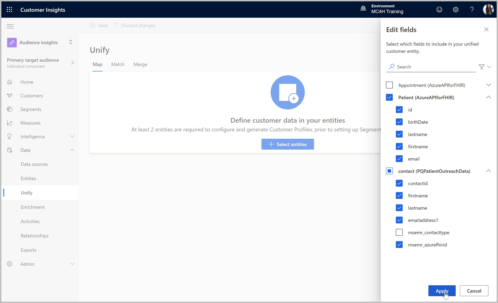
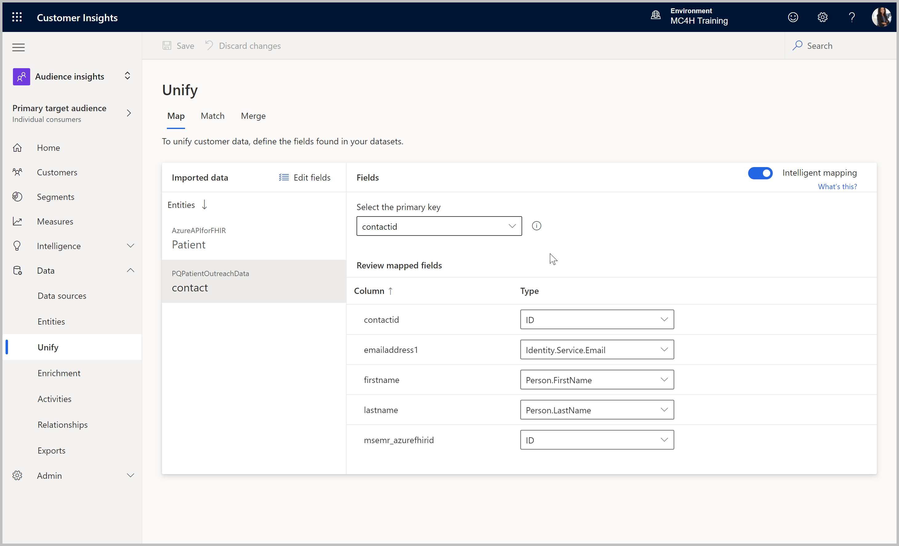
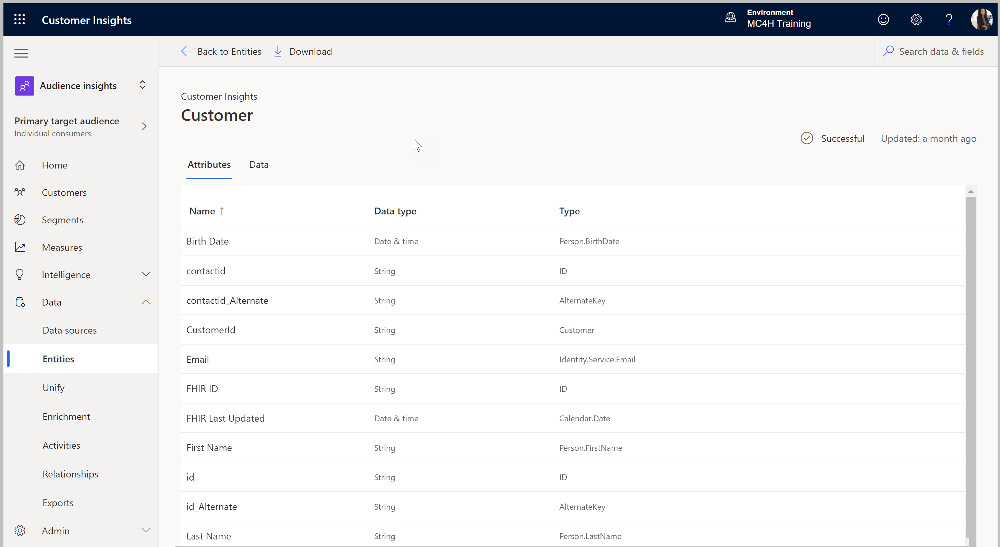

# Map, Match & Merge Patient Data
>**Objective:** 
Configure the mappings between patient records ingested from the FHIR Server and Dataverse and merge into unified profiles, using FHIR ID as the common unique identifier 

## Pre-requisites
* Customer Insights tenant subscription
* Admin or Contributor permissions to the Customer Insights environment
* Customer Insights labs [CI1](https://github.com/microsoft/MC4H-Acceleration/tree/main/PatientOutreach_UserStoryTraining/4_Customer_Insights_Config/Lab_CI1) and [CI2](https://github.com/microsoft/MC4H-Acceleration/tree/main/PatientOutreach_UserStoryTraining/4_Customer_Insights_Config/Lab_CI2) completed

## Outcomes
* FHIR and Dynamics 365 patient data merged into unified profiles
* Unified profile cards populated with merged data 

## Step 1: Map

1.	If not already there, go to the Customer Insights application and select the correct environment in the upper right corner if necessary. 
`https://home.ci.ai.dynamics.com/`

2.	Within the Audience Insights capability (default), expand into **Unify** under the Data navigation branch. 

3.	Click **Select Entities** and check the **Patient** and **contact** tables. Expand the contact table and **uncheck** the **msemr_contacttype** field from the contact table, as we don’t need it.  Click **Apply**.

4.	Click into each entity, and review the default mapping to common data model attribute types, updating as necessary to have the following mapping:

| Entities | Primary Key | Mapped Fields | Type (CDM) |
| --- | --- | --- | --- |
| Contact (D365/Dataverse) | contactid | contactid | ID |
| | | emailaddress1 | Identity.Service.Email |
| | | firstname | Person.FirstName |
| | | lastname | Person.LastName |
| | | msemr_azurefhirid	| ID |
| Patient (API for FHIR) | id | birthDate | Person.BirthDate |
| | | email | Identity.Service.Email |
| | | firstname | Person.FirstName |
| | | id | ID |
| | | lastname | Person.LastName |
| | | meta.lastUpdated | Calendar.Date |

5.	Click **Save** at the top of the page.

## Step 2: Match
1.	Move to the **Match** tab of the **Unify** data area. Note that both data sources are already added to the list. 
2.	Click the **Edit** button and change the order if necessary to make the Azure API for FHIR data source primary, and **include all records** from only the FHIR data source. For this exercise there may be sample patient data installed in D365 which will not have matches in FHIR, which we will ignore here.

3.	Click the Add rule button under the listed data sources and add a single condition that looks for an exact match on the FHIR ID in both data sources:
    * **Select entity**: [your FHIR datasource] and **Select field: id** 
    * Secondary entity will be selected by default, **Select field: msemr_azurefhirid**
    * Set **Precision** to **Basic** for an exact match
    * Give the rule a **Name** such as **ExactFHIRID**
    * Click **Done** once complete

4.	Click **Save** at the top of the page, and then click **Run** to begin matching. Once Complete, the insights will contain data and the status will show successful above the insights.

## Step 3: Merge

1.	Once the Match process has run successfully and you have at least one matching pair, move to the **Merge** tab of the **Unify** data area.

2. For the fields that are in both data, ensure that the FHIR API field is the first Rank, except Email. Adjust the rank for the Email fields to make the Dataverse email field the primary.
3. Select the **Keys** tab and check that the correct keys for each system are identified. The **CustomerID** with source System will also be listed - this is the Unified Profile identifier.

4. Finally, **Save** the changes and **Run only Merge**.

## Step 4: Validate the Unified Profiles

1. When the merge process is complete, a **Successful** status will show at the top right of the Merge page.
2. Navigate into the **Entities** area to find the **Customer** table listed under the **Profile** group. 
2.	Clicking into the table allows you to review the **Attributes** being ingested, as well as the actual data. Validate that the data is coming in as expected.  

> You completed the lab! 
Continue to the next lab: [Define Relationships & Activities](https://github.com/microsoft/MC4H-Acceleration/tree/main/PatientOutreach_UserStoryTraining/4_Customer_Insights_Config/Lab_CI4)