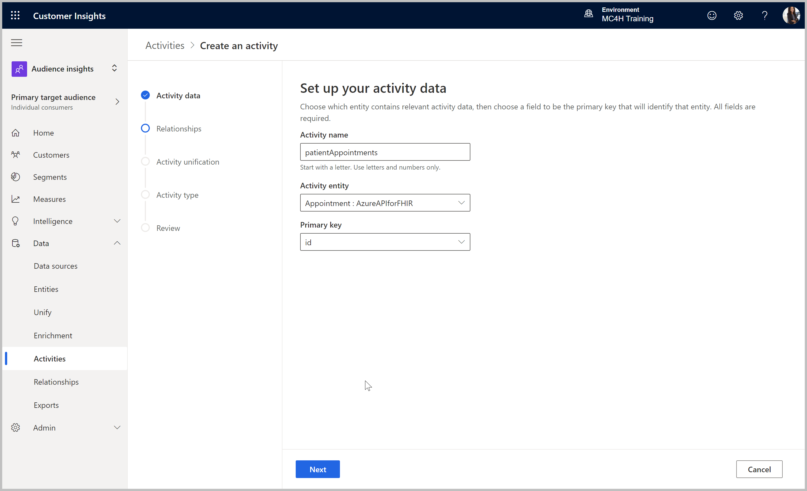
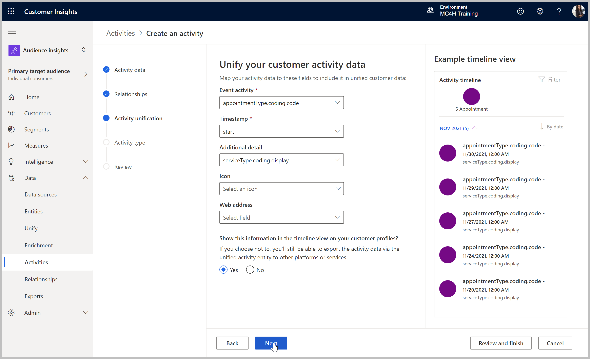
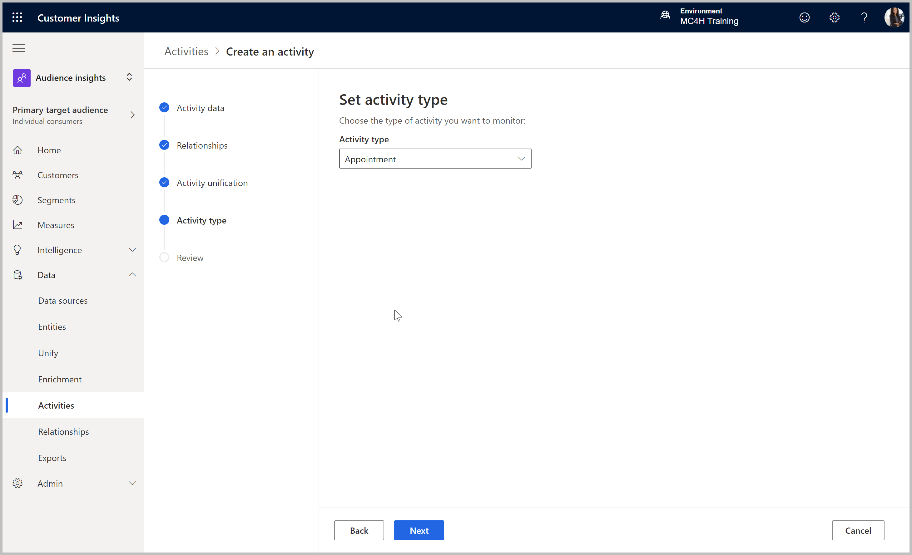
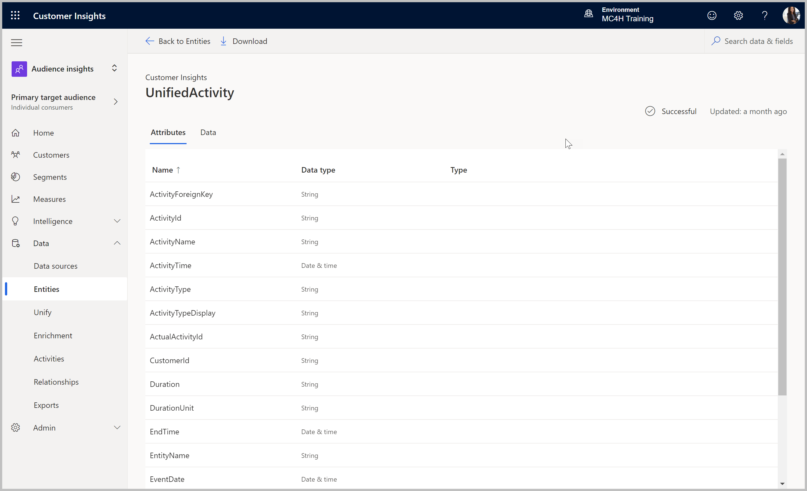

# Define Relationships & Activities
>**Objective:** 
Define relationships between unified data sets, and map Appointment data to the Activity CDM to populate the Unified Profile timeline.

## Pre-requisites
* Customer Insights tenant subscription
* Admin or Contributor permissions to the Customer Insights environment
* Customer Insights labs [CI1](https://github.com/microsoft/MC4H-Acceleration/tree/main/PatientOutreach_UserStoryTraining/4_Customer_Insights_Config/Lab_CI1),  [CI2](https://github.com/microsoft/MC4H-Acceleration/tree/main/PatientOutreach_UserStoryTraining/4_Customer_Insights_Config/Lab_CI2), and [CI3](https://github.com/microsoft/MC4H-Acceleration/tree/main/PatientOutreach_UserStoryTraining/4_Customer_Insights_Config/Lab_CI3) completed

## Outcomes

* Appointment entity defined as an Activity, and visible in the timeline of Unified Profiles
* Relationships defined between Appointment, D365 Contact, and API for FHIR Patient data sets for use in defining measures and segments

## Step 1: Set Up Appointment Activity
All data sources considered Activities should be defined as such, and mapped to the common data model to add those records to the Unified Activity entity, which will populate the timeline feed for the Unified Profile. This configuration will determine what details of the appointment record will show in the unified appointment activity in the timeline. 

1.	If not already there, go to the Customer Insights application and select the correct environment in the upper right corner if necessary. 
> https://home.ci.ai.dynamics.com/

2. Within the Audience Insights capability (default), expand into **Activities** in the **Data** navigation branch, and select **Create an activity**.

3. Give the unified Activity a name, point it to the **Appointment** entity from the Azure API for FHIR data source, set the **Primary key** to **id**, and click **Next**.

4. **Add a relationship** to define the link between the Appointment and the **Patient** entity of the Azure API for FHIR data source, using the Foreign key from Appointment **patient.id**. Name the relationship and **Apply**.

5. Review the defined relationship path and click **Next** to continue defining the activity. 

6. In the Activity unification step, map the fields from the Appointment entity to the standardized activity attributes, using the example timeline view as a guide, for example:
    * Event activity: **appointmentType.coding.code**
    * Timestamp: **start**
    * Additional detail: **serviceType.coding.display**
    * Icon: blank
    * Web address: blank
    * Show this information in the timeline: **Yes**

7. Once happy with the timeline view of the activity, click **Next**, and select **Appointment** as the Activity Type. 

8. Finally, move on to the **Review** page and **Save activity**. The new activity will be listed. If the status at the top right does not already say **Refreshing**, click **Run**. 

## Step 2: Define Relationships

1. Go to **Relationships** under the Data navigation branch. The relationship just defined as a part of the Appointment Activity should be listed. 

2. To add more relationship paths for use in building measures, segments, etc., select **New Relationship**. The below lists some relationships that can be created.

| Relationship | Entity | Cardinality | Field (Key) |
| --- | --- | --- | --- |
| D365 Contact to FHIR Patient | contact : [Dataverse patient data source] | One | msemr_azurefhirid |
|  | Patient : [FHIR API data source] | One | id |
| FHIR Appointment to unified Customer | Appointment : [FHIR API data source] | Many | patient.id |
|  | Customer : CustomerInsights | One | id |

> NOTE: Because the unified Customer entity inherits the keys from each source entity, the **id** field in the Customer table is the inherited unique FHIR ID, and the **contactid** in the Customer table is the inherited unique Dataverse ID. If this is confusing, key fields can be renamed during the transformation process of the Data Sources to be more descriptive. Non-key fields can be renamed during the Merge stage of the Unification process. 

4. Click the Visualizer button to change the view, and adjust the filter to show all entity and relationship types. 

## Validate Unified Activity Data

1. Once the **Activity** page shows a status of **Successful**, validate the unified activity data by going into **Entities** area to find a the **UnifiedActivity** table listed under the **Activities** group. 

2.	Clicking into the table allows you to review the **Attributes** we defined during configuration, as well as the actual data. Validate that the data is coming in as expected. 

> You completed the lab! 
Continue to the next lab: [Create Patient Measures and Segments](https://github.com/microsoft/MC4H-Acceleration/tree/main/PatientOutreach_UserStoryTraining/4_Customer_Insights_Config/Lab_CI5)