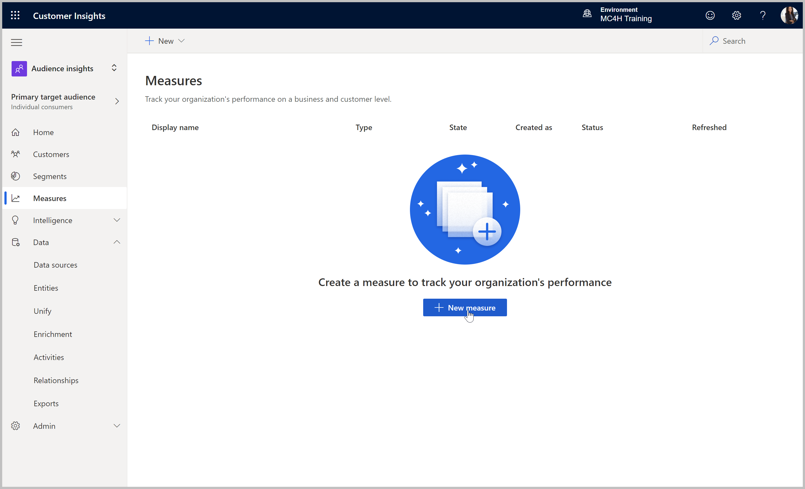
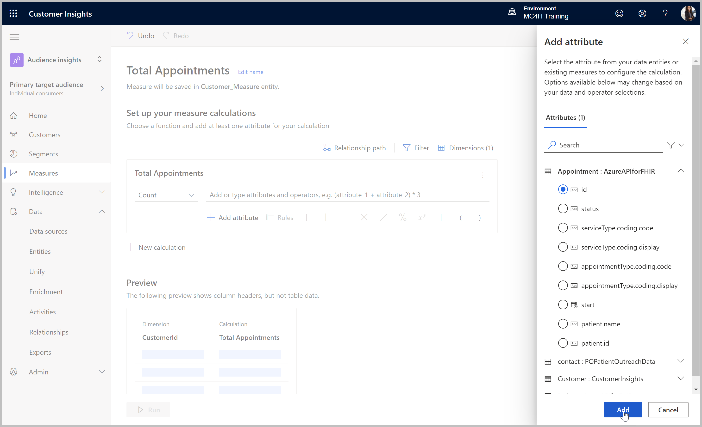
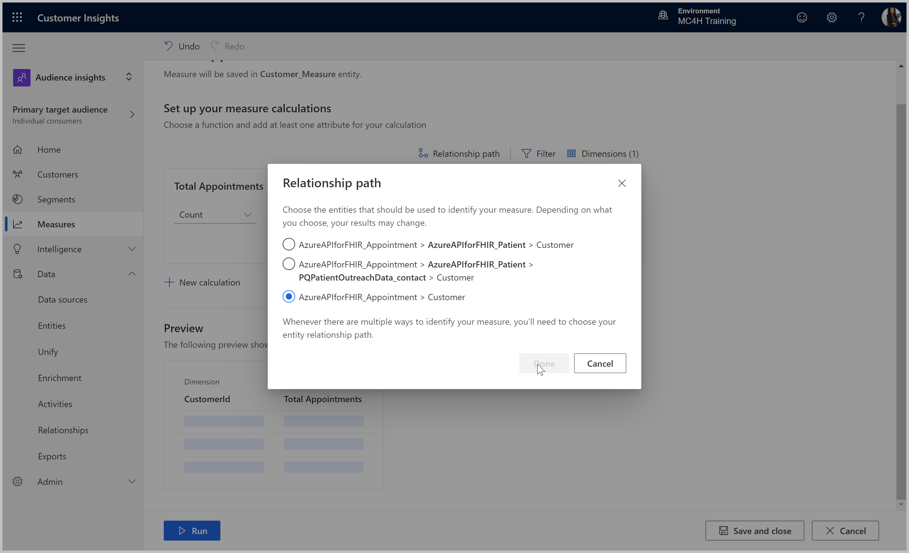
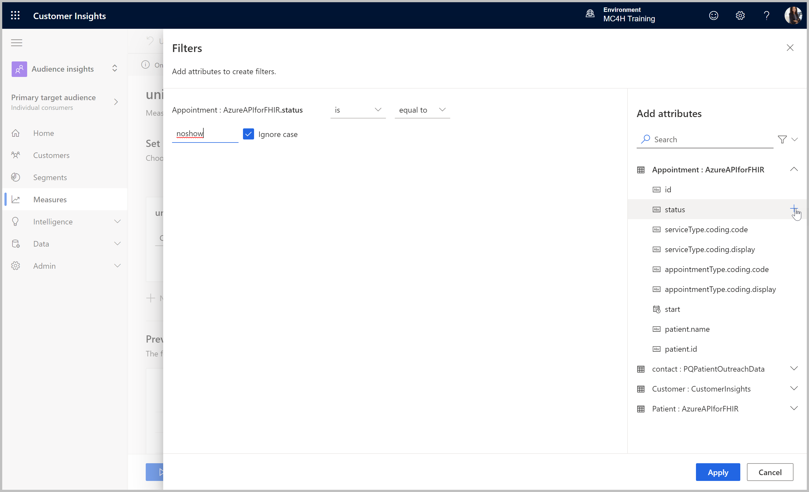
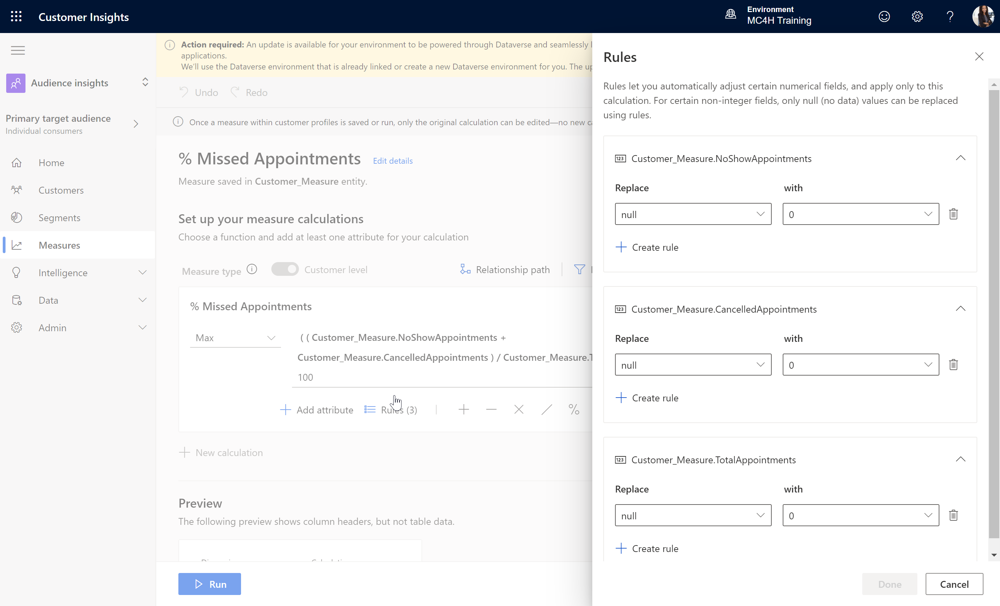
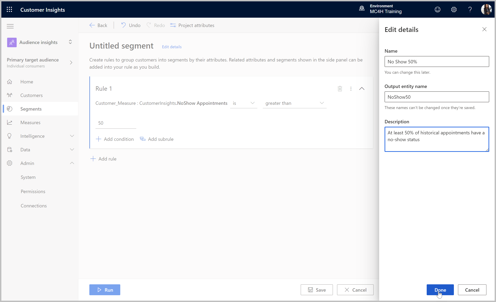
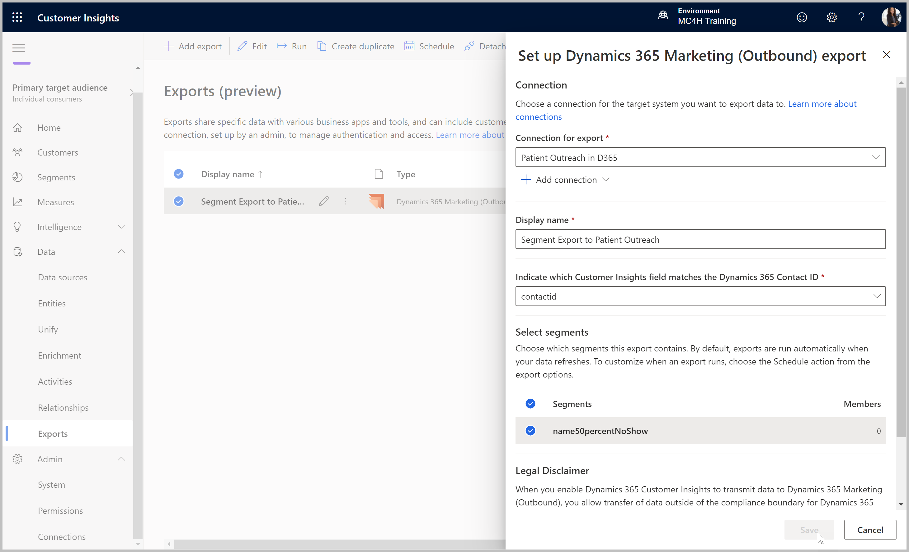

# Define Patient Measures & Segments
>**Objective:** 
Configure key measures based on historical appointment data, and segments based on those measures for use within Dynamics 365 Marketing.

## Outcomes
* Published Missed Appointment Measures
* Missed Appointment patient segments configured and exported to Dynamics 365 Marketing
> **Estimated Time Commitment:** 
> About 20min

## Pre-requisites
* Customer Insights tenant subscription
* Admin or Contributor permissions to the Customer Insights environment
* Access and permissions to the D365 environment
* Customer Insights labs [CI1](https://github.com/microsoft/MC4H-Acceleration/tree/main/PatientOutreach_UserStoryTraining/4_Customer_Insights_Config/Lab_CI1),  [CI2](https://github.com/microsoft/MC4H-Acceleration/tree/main/PatientOutreach_UserStoryTraining/4_Customer_Insights_Config/Lab_CI2), [CI3](https://github.com/microsoft/MC4H-Acceleration/tree/main/PatientOutreach_UserStoryTraining/4_Customer_Insights_Config/Lab_CI3), and [CI4](https://github.com/microsoft/MC4H-Acceleration/tree/main/PatientOutreach_UserStoryTraining/4_Customer_Insights_Config/Lab_CI4) completed

## Step 1: Configure Measures

1.	If not already there, go to the Customer Insights application and select the correct environment in the upper right corner if necessary. 
> https://home.ci.ai.dynamics.com/

2. Within the Audience Insights capability (default), select **Measures** and click **New measure**.

3. Click **Edit name** and name the measure **Total Appointments**.

4. Set the formula to `Count Unique [FHIR data source]_Appointment.id`:
    * Click **Select function** and choose **Count** 
    * Click **Add attribute** and select **Appointment: id**

5. Click **Relationship path** to define the path to Appointment from the unified Customer, and select the most direct path.

6. Click **Run** to save the measure and run the calculation.

| Measure | Formula | Filter | Rules |
| --- | --- | --- | --- |
| NoShow Appointments | `Count Unique [FHIR data source]_Appointment.id` | `Appointment.status is equal to noshow` (ignore case) | none |
| Cancelled Appointments | `Count Unique [FHIR data source]_Appointment.id` | `Appointment.status is equal to cancelled` (ignore case) | none |
| % No Show Appointments | `Average ( Customer_Measure.NoShowAppointments / Customer_Measure.TotalAppointments ) * 100` | none | **Replace null with 0** for used reference measures |
| % Missed Appointments | `Max  ( ( Customer_Measure.NoShowAppointments + Customer_Measure.CancelledAppointments ) / Customer_Measure.TotalAppointments ) * 100`| none | **Replace null with 0** for used reference measures |

7. Repeat the previous steps, using Filter and Rule feature steps below as needed to create more measures, as listed in the table above. 
    > NOTE: 
    > For measures that use other measures in their logic, you will need to wait for them to refresh successfully before they will be available in the attribute pane. 

8. Use the **Filter** button above the calculation to add filters on the Appointment.status field.

9. Use the **Rules** button below the calculation to replace troublesome values (such as nulls that would cause an error in a % calculation)

> EXTRA CHALLENGE: 
> Use the Measure Templates to create a **Days since last appointment** measure.

## Step 2: Configure Segments

> NOTE: Measure refreshes from the last step will need to be completed and successful before they can be referenced in Segment configurations.

1. Go the the **Segments** area and select **New segment**.

2. Use the **Add to Rule** pane on the right to browse into defined **Customer_Measures** and select the **NoShow Appointments** measure.

3. Complete the rule condition to be: 
`Customer_Measure : CustomerInsights.NoShow Appointments is greater than 50`

4. Click the **Edit details** link at the top of the page to name the segment **No Show over 50 percent** or similar.

5. Click **Run** to save and activate the segment.

6. Repeat the previous steps to create an additional segment as **Missed over 50 percent**, with the following condition: 
`Customer_Measure : CustomerInsights.Cancelled Appointments is greater than 50`

## Step 3: Configure Segment Export to Dynamics 365 Marketing

> NOTE: Segment refreshes from the last step will need to be completed and successful before they can be used in Export configurations.

1. Expand into the **Admin > Connections** area, scroll down under Export connections to find **Dynamics 365 Marketing (Outbound)**, and click **Set up**.

2. Configure the connection to point to the Dynamics 365 Marketing organization of the format: 
`https://[orgname].crm.dynamics.com` 
    > NOTE: if in a region other than North America the .crm domain may be different

3. Sign in as a user with admin privileges on the Marketing org, agree to the data sharing between Customer Insights and Dynamics 365 Marketing, and click **Save**.

4. Using the new connection, configure the export to match on **contactid** within Dynamics and select both segments to be exported with each refresh, and select **Save**.

5. If not already refreshing, select the export just configured in the **Connections > Exports** area and click **Run**.

> You completed the lab! 
Continue to the next module: [Dynamics 365 Configuration](https://github.com/microsoft/MC4H-Acceleration/tree/main/PatientOutreach_UserStoryTraining/5_D365_Marketing_Config)